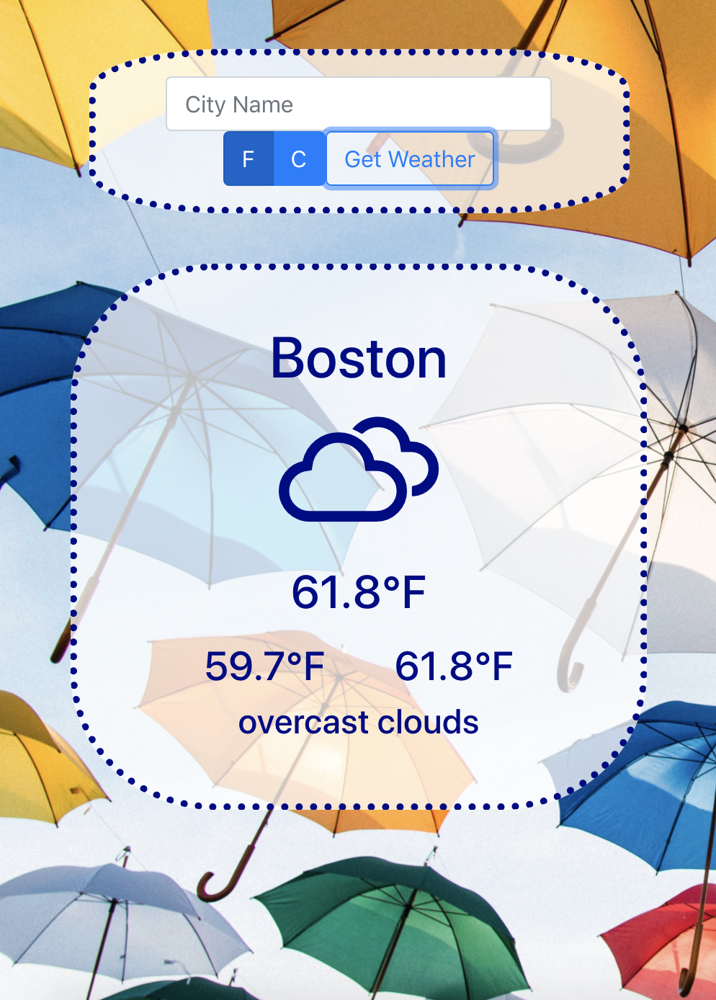

# Right as Rain

## Project Description
A weather forecasting app for users to get the temperature and weather conditionof a particular location.  Inspired from [florinpop17 / app-ideas ...Weather App](https://github.com/florinpop17/app-ideas/blob/master/Projects/1-Beginner/Weather-App.md)

## Dependencies
* [Create React App](https://github.com/facebook/create-react-app)
  - [documentation](https://facebook.github.io/create-react-app/docs/getting-started)
  - [making a progressive web app](https://facebook.github.io/create-react-app/docs/making-a-progressive-web-app)
  - [deployment](https://facebook.github.io/create-react-app/docs/deployment)
* [Weather Icons](https://erikflowers.github.io/weather-icons/)
* [npm](https://www.npmjs.com/): `npm install`
* [React Bootstrap](https://react-bootstrap.github.io/): `npm install react-bootstrap bootstrap`
* [Axios](https://www.axios.com/): `npm install axios`
* [Styled Components](https://styled-components.com/): `npm install styled-components`

## User Stories
As a User I would like to...
* Enter the name of a city into the input field
* submit the name of the city which to update the DOM with the relevant weather forecasting information

## Future Goals
* incorporate localStorage so that when the user closes the browser and returns, the name of their city will be retrieved to make an api call to update the DOM
* Adjust the background image to compliment each loaded forecast
